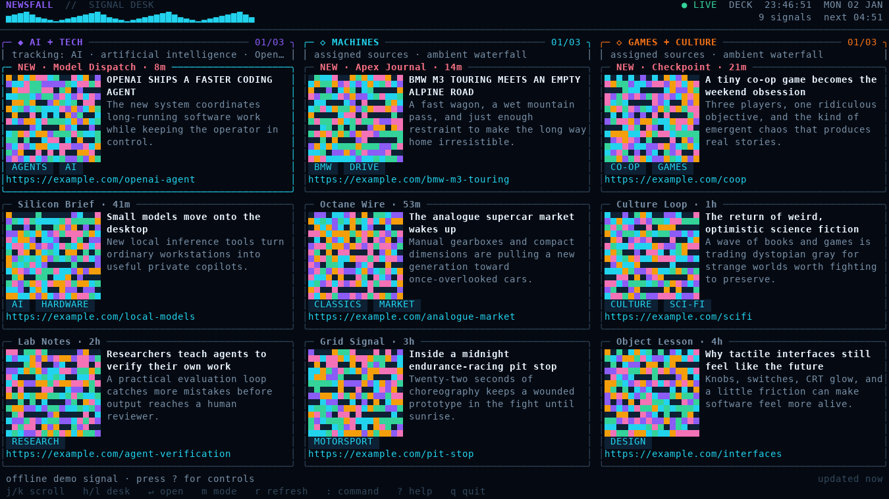

# NEWSFALL

**An ambient signal desk for your terminal.** Newsfall is part TweetDeck, part RSS reader, and part animated desktop object: a colorful one-, two-, or three-column news stream designed to stay open beside tools such as `btop`.



Newsfall continuously refreshes RSS, Atom, and JSON feeds; routes stories into topic columns; drifts through headlines while idle; and turns article images into compact true-color Unicode mosaics. When a story has no usable image, it generates deterministic cover art from the story metadata, so the screen still feels alive.

## What it does

- Responsive **deck mode** with one to three independently filtered columns.
- Chronological **stream mode** for a single top-to-bottom waterfall.
- Title, source, age, category chips, excerpt, visible URL, and OSC 8 clickable link on each selected card.
- Actual article-image mosaics for JPEG, PNG, and GIF images, with colorful generated art as the fallback.
- Cache-first startup: the last useful screen remains available when a source is slow or offline.
- In-app commands for feeds, columns, topics, refresh cadence, drift cadence, themes, and images.
- Four themes: `aurora`, `ember`, `ocean`, and `mono`.
- No account, server, API key, database, or third-party runtime dependency.

The default desk is intentionally tuned around three interests:

1. `AI + TECH`
2. `MACHINES`
3. `GAMES + CULTURE`

Every starter source and topic is replaceable.

## Install

### Prebuilt binary

Choose the binary for your machine, rename it to `newsfall`, and put it somewhere on your `PATH`:

```sh
mkdir -p "$HOME/.local/bin"
install -m 755 ./newsfall-darwin-arm64 "$HOME/.local/bin/newsfall"
newsfall --demo
```

The example above is for an Apple-silicon Mac. Use `newsfall-darwin-amd64` for an Intel Mac, `newsfall-linux-amd64` for ordinary 64-bit Linux, or `newsfall-linux-arm64` for ARM Linux.

If `~/.local/bin` is not already on your path, add this to `~/.zshrc`:

```sh
export PATH="$HOME/.local/bin:$PATH"
```

The supplied macOS binaries are not code-signed or notarized. If macOS attaches a quarantine flag and refuses to open the binary, remove that flag from this specific file:

```sh
xattr -d com.apple.quarantine "$HOME/.local/bin/newsfall"
```

### Build from source

Go 1.23 or newer is the only build requirement:

```sh
cd /path/to/newsfall
go test ./...
go build -trimpath -ldflags='-s -w' -o "$HOME/.local/bin/newsfall" ./cmd/newsfall
```

## Start it

```sh
newsfall
```

### Upgrading from 0.1.0

Version 0.1.1 fixes two macOS/Warp defects in the first build: interactive input stopped after the terminal had been idle for roughly 100 ms, and raw-terminal rows were emitted without carriage returns, causing most of the deck to render against the right edge. Replace the old binary in place; your configuration and cached articles are preserved. If a 0.1.0 process is currently stuck, open another terminal tab and run `pkill newsfall` before installing the replacement.

On first launch, Newsfall writes a readable JSON configuration and starts synchronizing the starter feeds. To explore the complete interface without network access or changing your config:

```sh
newsfall --demo
```

A static terminal preview is also available:

```sh
newsfall --demo --snapshot --width 150 --height 40
newsfall --demo --snapshot --plain --width 100 --height 28
```

Newsfall uses the terminal's alternate screen, restores terminal settings on exit, and supports live resize on macOS and Linux. A terminal with 24-bit color gives the best result. OSC 8 support makes the displayed URLs clickable, but `enter` / `o` opens them through the system browser in any supported terminal.

## Keyboard

| Key | Action |
|---|---|
| `j` / `k` or `↓` / `↑` | Move through stories |
| `h` / `l` or `←` / `→` | Move between columns |
| `g` / `G` | Jump to the first / last story |
| `enter` or `o` | Open the selected article in the default browser |
| `r` | Refresh now |
| `p` | Pause or resume refresh and ambient drift |
| `a` | Toggle ambient drift |
| `m` | Toggle deck / stream mode |
| `i` | Toggle article-image loading |
| `tab` | Cycle the theme |
| `:` | Open the command line |
| `?` | Open or close help |
| `q` or `ctrl-c` | Quit |

## Configure it inside the app

Press `:` and enter a command. Arguments containing spaces can be quoted.

```text
feed list
feed add https://example.com/feed.xml "Example Wire" ai
feed remove "Example Wire"

column list
column add science "SCIENCE + SPACE" space climate NASA
column remove science

topic add ai "machine learning" robotics
topic remove ai robotics

refresh 5m
refresh now
drift 12s
theme ocean
mode stream
images off
ambient on
reload
help
```

A feed can be pinned to one or more columns by supplying comma-separated column IDs as the last `feed add` argument:

```text
feed add https://example.com/feed.xml "Example Wire" ai,machines
```

When a feed is pinned, its stories are eligible only for those columns and still must satisfy that column's include/exclude topic rules. An unpinned feed is routed entirely by topic rules; a column with no include terms behaves as a catch-all.

Newsfall intentionally supports **one to three columns**. This keeps cards readable and preserves the dashboard feel instead of turning the terminal into a wall of narrow text.

## Configure it from the shell

Every in-app command can also be applied noninteractively:

```sh
newsfall --command 'feed list'
newsfall --command 'feed add https://example.com/feed.xml "Example Wire" ai'
newsfall --command 'topic add ai robotics agents'
newsfall --command 'theme ember'
newsfall --command 'refresh 10m'
```

Useful CLI options:

```text
--demo              use the built-in offline stories
--snapshot          render one frame and exit
--plain             remove ANSI color from a snapshot
--width N           choose snapshot width
--height N          choose snapshot height
--config PATH       use a different config file
--data PATH         use a different article cache
--command TEXT      apply one configuration command and exit
--config-path       print the resolved config path
--version           print the version
```

## Configuration file

Default paths:

```text
~/.config/newsfall/config.json
~/.local/share/newsfall/articles.json
```

`XDG_CONFIG_HOME` and `XDG_DATA_HOME` are respected. The configuration is ordinary JSON and is safe to edit while Newsfall is closed. While it is open, edit the file and run `:reload`.

A complete example is in [`examples/config.json`](examples/config.json). The important structure is:

```json
{
  "refresh": "5m",
  "drift": "12s",
  "mode": "deck",
  "theme": "aurora",
  "images": true,
  "ambient": true,
  "columns": [
    {
      "id": "ai",
      "title": "AI + TECH",
      "include": ["AI", "OpenAI", "agent", "model"],
      "exclude": ["fundraising"],
      "accent": "#8B5CF6"
    }
  ],
  "feeds": [
    {
      "name": "Example Wire",
      "url": "https://example.com/feed.xml",
      "columns": ["ai"],
      "tags": ["technology"]
    }
  ]
}
```

Feed URLs must be HTTP or HTTPS. Configuration and cache updates are written through a temporary file and atomic rename. Remote titles and excerpts are HTML-decoded, stripped of markup, normalized, and scrubbed of terminal control sequences before rendering.

## Feed and image behavior

Newsfall understands:

- RSS 0.9x / 2.0
- RSS 1.0 / RDF
- Atom
- JSON Feed 1.x

Sources refresh concurrently with bounded concurrency and timeouts. One malformed or unavailable source is reported in the footer but does not blank the other columns or erase cached stories.

For article images, Newsfall deliberately uses terminal-independent ANSI/Unicode output rather than Kitty graphics, Sixel, or iTerm2 proprietary image escape sequences. JPEG, PNG, and GIF decode directly. AVIF and WebP images currently fall back to generated artwork so the application can remain a single zero-dependency binary.

## Development

```sh
make test       # format check, unit tests, and vet
make race       # race-enabled test suite
make snapshot   # write a demo ANSI snapshot to dist/
make release    # cross-compile macOS and Linux binaries
```

The code is split into small packages for configuration, normalized articles, remote-content cleanup, feed parsing/fetching, caching, commands, navigation, image loading, terminal state, rendering, and the runtime event loop. Network tests use local HTTP fixtures and do not depend on public sites.

## First-release boundaries

Newsfall is a feed desk, not a read-later database or social network. Version 0.1 intentionally omits account sync, notifications, full-article extraction, AI summaries, OPML import/export, and native terminal image protocols. Its local JSON design keeps the first release inspectable and easy to modify.

## License

MIT. See [`LICENSE`](LICENSE).
